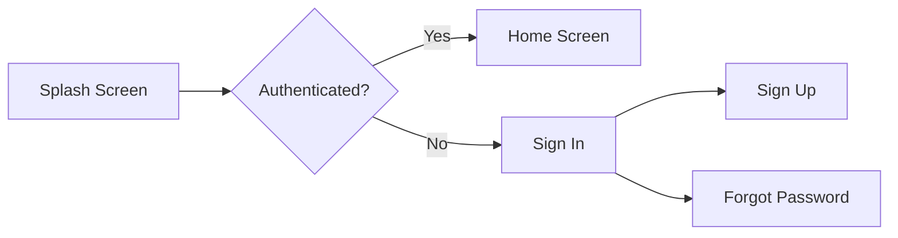

# 🌍 VoyageMate

<div align="center">


**Your Trusted Travel Companion**

[](https://flutter.dev)
[](https://firebase.google.com)
[](https://dart.dev)

</div>

---

## 📱 About

VoyageMate is a modern Flutter travel application that helps users discover amazing destinations, save their favorite trips, and manage their travel experiences seamlessly with Firebase integration.

## ✨ Features

<table>
<tr>
<td width="50%">

### 🔐 Authentication
- ✅ Email/Password Sign In & Sign Up
- 🔑 Google Sign-In Integration
- 🔄 Password Recovery System
- 👤 User Profile Management

</td>
<td width="50%">

### 🗺️ Trip Management
- 🏖️ Browse Available Destinations
- ⭐ Save Favorite Trips
- ✈️ Track Visited Places
- 📊 Ratings & Reviews System

</td>
</tr>
</table>

### 🎯 Core Functionality

```
📍 Trip Details          🖼️ Image Galleries        📅 Trip Schedules
💰 Pricing Info         🌟 User Reviews           🔍 Search Feature
📱 Responsive Design    🎨 Material UI            💾 Cloud Storage
```

---

## 🛠️ Tech Stack

| Category | Technology |
|----------|-----------|
| **Framework** | Flutter |
| **Language** | Dart |
| **State Management** | Provider |
| **Backend** | Firebase (Auth + Firestore) |
| **Authentication** | Firebase Auth + Google Sign-In |
| **UI/UX** | Material Design + ScreenUtil |

---

## 📂 Project Structure

```
lib/
├── 📁 core/
│   ├── 📁 constants/
│   │   ├── 📄 trips.dart              # Data Models
│   │   └── 📄 ui_constants.dart       # UI Assets
│   ├── 📁 controllers/
│   │   └── 📁 provider/
│   │       └── 📄 trip_provider.dart  # State Management
│   └── 📁 widgets/
│       ├── 📄 custom_app_bar.dart     # Reusable AppBar
│       └── 📄 custom_card.dart        # Trip Card Widget
│
├── 📁 screens/
│   ├── 📁 app_screens/
│   │   ├── 📄 home_screen.dart
│   │   ├── 📄 details_screen.dart
│   │   ├── 📄 saved_trips_screen.dart
│   │   ├── 📄 visited_trips_screen.dart
│   │   ├── 📄 profile_screen.dart
│   │   └── 📄 setting_screen.dart
│   │
│   ├── 📁 login_and_registration_screens/
│   │   ├── 📄 sign_in_screen.dart
│   │   ├── 📄 sign_up_screen.dart
│   │   ├── 📄 forget_password.dart
│   │   └── 📄 verification_screen.dart
│   │
│   └── 📄 splash_screen.dart
│
├── 📄 firebase_options.dart
└── 📄 main.dart
```

---

## 🎨 Design System

### Color Palette

<table>
<tr>
<td align="center" bgcolor="#2973B2" width="25%">
<br><b style="color:white;">Primary</b><br><code style="color:white;">#2973B2</code><br><br>
</td>
<td align="center" bgcolor="#CCD3DA" width="25%">
<br><b>Background</b><br><code>#CCD3DA</code><br><br>
</td>
<td align="center" bgcolor="#002347" width="25%">
<br><b style="color:white;">Text Primary</b><br><code style="color:white;">#002347</code><br><br>
</td>
<td align="center" bgcolor="#596C86" width="25%">
<br><b style="color:white;">Text Secondary</b><br><code style="color:white;">#596C86</code><br><br>
</td>
</tr>
</table>

---

## 🚀 Getting Started

### Prerequisites

```bash
✓ Flutter SDK (latest stable)
✓ Firebase Account
✓ Android Studio / VS Code
✓ Git
```

### Installation

```bash
# 1️⃣ Clone the repository
git clone https://github.com/yourusername/voyagemate.git

# 2️⃣ Navigate to project
cd voyagemate

# 3️⃣ Install dependencies
flutter pub get

# 4️⃣ Run the app
flutter run
```

### Firebase Setup

1. **Create Firebase Project**
   - Go to [Firebase Console](https://console.firebase.google.com)
   - Create new project

2. **Add Firebase to Flutter**
   ```bash
   # Install FlutterFire CLI
   dart pub global activate flutterfire_cli
   
   # Configure Firebase
   flutterfire configure
   ```

3. **Enable Services**
   - ✅ Authentication (Email/Password & Google)
   - ✅ Cloud Firestore
   - ✅ Firebase Storage (optional)

4. **Google Sign-In**
   - Add SHA-1 fingerprint
   - Configure OAuth consent screen

---

## 📊 Database Structure

```
Firestore Database
│
└── users/
    └── {userId}/
        ├── trips/                    # User trips collection
        │   └── {tripId}
        │       ├── agencyName
        │       ├── title
        │       ├── description
        │       ├── imageUrl
        │       ├── rating
        │       ├── isSaved
        │       ├── isVisited
        │       ├── duration
        │       └── location
        │
        └── DetailsTrips/             # Detailed trip info
            └── {tripId}
                ├── title
                ├── location
                ├── price
                ├── rating
                ├── aboutDestination
                ├── scheduleItems[]
                ├── reviews[]
                ├── heroImage
                └── galleryImages[]
```

---

## 📦 Key Dependencies

```yaml
dependencies:
  flutter:
    sdk: flutter
  
  # Firebase
  firebase_core: ^latest
  firebase_auth: ^latest
  cloud_firestore: ^latest
  
  # Authentication
  google_sign_in: ^latest
  
  # State Management
  provider: ^latest
  
  # UI
  flutter_screenutil: ^latest
```

---

## 🎯 Key Features Walkthrough

### 1. Authentication Flow



### 2. Trip Management

| Action | Description |
|--------|-------------|
| **Browse** | View all available trips with images and ratings |
| **Save** | Bookmark trips for future reference |
| **Visit** | Mark trips as visited |
| **Details** | View comprehensive trip information |

### 3. State Management

Uses **Provider** pattern for:
- 🔄 Real-time trip updates
- 💾 Save/Unsave operations
- 🔍 Filtering (saved/visited trips)
- 🔔 UI notifications


---

## 🔮 Roadmap

- [ ] 🔍 Advanced search with filters
- [ ] 📍 Map integration
- [ ] 💬 In-app messaging
- [ ] 🎫 Trip reservation system
- [ ] 📝 User review submission
- [ ] 🌐 Multi-language support
- [ ] 📴 Offline mode
- [ ] 🤖 AI trip recommendations
- [ ] 🎨 AR features

---

## 🐛 Known Issues

- ⚠️ Hardcoded USER_ID in SavedTripsScreen
- ⚠️ No pagination for large trip lists
- ⚠️ Limited offline support

---

## 🤝 Contributing

We welcome contributions! Here's how you can help:

1. 🍴 Fork the repository
2. 🌿 Create a feature branch (`git checkout -b feature/AmazingFeature`)
3. 💾 Commit changes (`git commit -m 'Add AmazingFeature'`)
4. 📤 Push to branch (`git push origin feature/AmazingFeature`)
5. 🎉 Open a Pull Request

---

## 📄 License

This project is licensed under the MIT License - see the [LICENSE](LICENSE) file for details.

---

<div align="center">

**Made with ❤️ using Flutter**

⭐ Star us on GitHub — it motivates us a lot!

[Report Bug](https://github.com/yourusername/voyagemate/issues) · [Request Feature](https://github.com/yourusername/voyagemate/issues)

</div>
